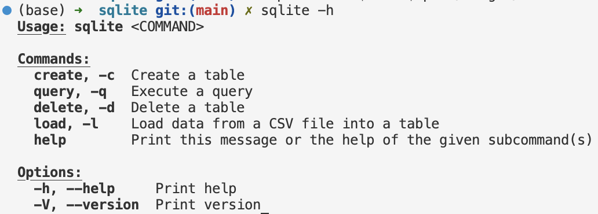
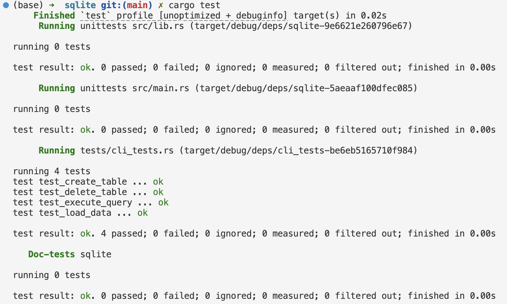

[](https://github.com/nogibjj/Ailina_Aniwan_Mini_Project_7/actions/workflows/CI.yml)
# IDS706 - Individual Project 2 - Ailina Aniwan

## Rust CLI Binary with SQLite

## ✔️ Project Overview
This project is a Rust-based command-line tool for performing SQL operations (Create, Read, Update, Delete) on a SQLite database. It allows users to manage tables and interact with data through simple CLI commands. The project leverages Rust's `clap` library for command-line argument parsing, `rusqlite` for database interaction, and `csv` for data loading.

## ✔️ Project Requirements
- **Rust source code:** The code should comprehensively understand Rust's syntax and unique features.
- **Use of GitHub Copilot:** In your README, explain how you utilized GitHub Copilot in your coding process.
- **SQLite Database:** Include a SQLite database and demonstrate CRUD (Create, Read, Update, Delete) operations.
- **Optimized Rust Binary:** Include a process that generates an optimized Rust binary as a GitHub Actions artifact that can be downloaded.
- **README.md:** A file that clearly explains what the project does, its dependencies, how to run the program, and how GitHub Copilot was used.
- **GitHub Actions:** A workflow file that tests, builds, and lints your Rust code.
- **Video Demo:** A YouTube link in README.md showing a clear, concise walkthrough and demonstration of your CLI binary.

## ✔️ GitHub Copilot Usage
GitHub Copilot provided suggestions that accelerated development, including:
- Generating efficient Rust syntax for database operations.
- Structuring error handling patterns to improve code readability and reliability.
- Offering boilerplate Rust functions for CRUD operations, reducing manual coding time. These contributions helped streamline development, especially for repetitive tasks and syntax checks.


## ✔️ Functionality and User Guide
### Prerequisites
First, ensure your Rust environment is already set up. You can verify the installation by running:
```bash
cargo --version
```
### Dependencies
Run the following commands in your terminal to add necessary dependencies. These commands modify the Cargo.toml file to include required libraries:
```bash
cargo add clap --features derive
cargo add rusqlite
cargo add csv
```
### Building the Project
To compile and build the project, navigate to the project root directory and run:
```bash
cargo build --release
```
### Setting the Path
Export the release folder to your path so you can run the CLI commands directly from any location. Adjust the path to match your setup:
```bash
export PATH=$PATH:$(pwd)/target/release
```
### SQLite Database (CRUD Operations)
The tool supports full CRUD operations on the SQLite database:
- **Create** (`-c`): Creates a new table.
- **Read** (`-r`): Reads and displays all data from a table.
- **Update** (`-u`): Updates records in a specified table.
- **Delete** (`-d`): Deletes a specified table.
- **Load** (`-l`): Loads data from a CSV file into a specified table.

Each command can be accessed with both its full name and its short alias.

### Command Overview
For a quick overview of available commands, you can use:
```bash
sqlite -h
```


### Command Usage
To create a new table, use the `-c` flag:
```bash
sqlite -c name_age_table
```
To load data from a CSV file into the table, use the `-l` flag and specify the table name and file path:
```bash
sqlite -l name_age_table ../data/sample_data.csv
```
To read data from the table, use the `-r` flag:
```bash
sqlite -r name_age_table
```
To update a record in the table, use the `-u` flag, specifying the column, new value, and a condition:
```bash
sqlite -u name_age_table age 18 "name = 'Alice'"
```
To delete a table, use the `-d` flag:
```bash
sqlite -d name_age_table
```


### Testing
This project includes automated tests located in the `tests/cli_tests.rs` file. These tests verify the functionality of each command (Create, Load, Read, Update, Delete).

To run the tests, execute:
```bash
cargo test
```


## ✔️ Optimized Rust Binary
The project generates an optimized binary for production, compiled with:
```bash
cargo build --release
```
The binary is available for download as a GitHub Actions artifact: [Binary Artifact Download Link](https://github.com/nogibjj/Ailina_Aniwan_Individual_Project_2/actions/runs/11585801062/artifacts/2120972109)

## ✔️ Video Demo
[Click Here For YouTube Video Demo](https://www.youtube.com/watch?v=pGTLPDXGixA)